# VibingIDE — Technical Architecture

## 1. Technology Stack

| Layer | Technology | Rationale |
|---|---|---|
| Language | **Rust (stable)** | Memory safety, zero-cost abstractions, no GC pauses |
| UI Rendering | **[Ratatui](https://github.com/ratatui-org/ratatui)** | TUI framework; battle-tested, GPU-free, cross-platform |
| Terminal backend | **Crossterm** | Cross-platform terminal I/O |
| PTY (Unix) | **`portable-pty`** crate | Spawns processes in a pseudo-terminal |
| PTY (Windows) | **ConPTY** via `portable-pty` | Windows Console Pseudoconsole API |
| ANSI parsing | **`vte`** crate | VT100/ANSI escape sequence state machine |
| Async runtime | **Tokio** | I/O multiplexing across multiple PTY streams |
| Serialization | **Serde + serde_json** | Session history persistence (NDJSON) |
| Config | **`toml`** crate | User config file parsing |
| File watching | **`notify`** crate | Watch project directory for file tree changes |

> **Why TUI over GUI?** A terminal UI keeps the binary < 25 MB, starts instantly, and works over SSH — a common agent-use-case.

---

## 2. High-Level Architecture

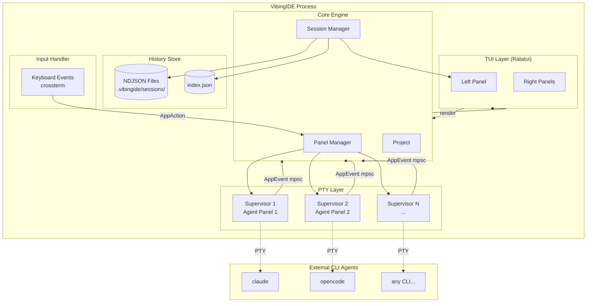

---

## 3. Module Structure

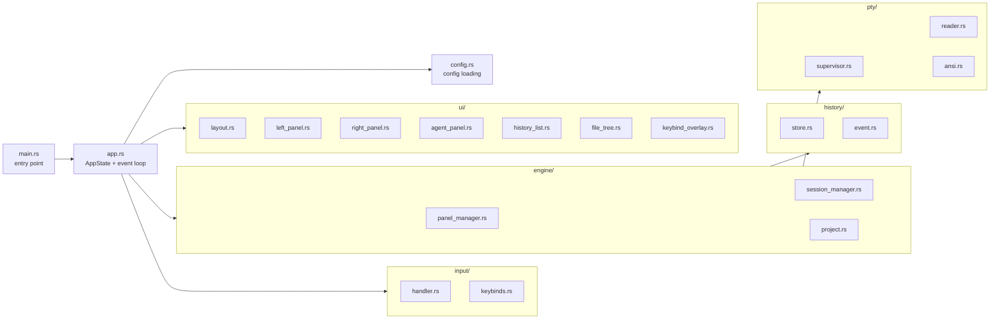

---

## 4. Core Data Flow

### 4.1 Startup Sequence

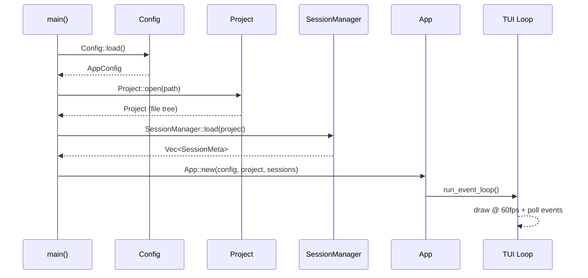

### 4.2 Adding an Agent Panel

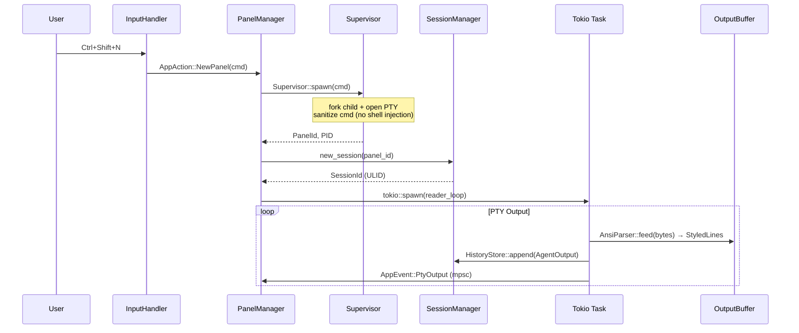

### 4.3 User Sends Input

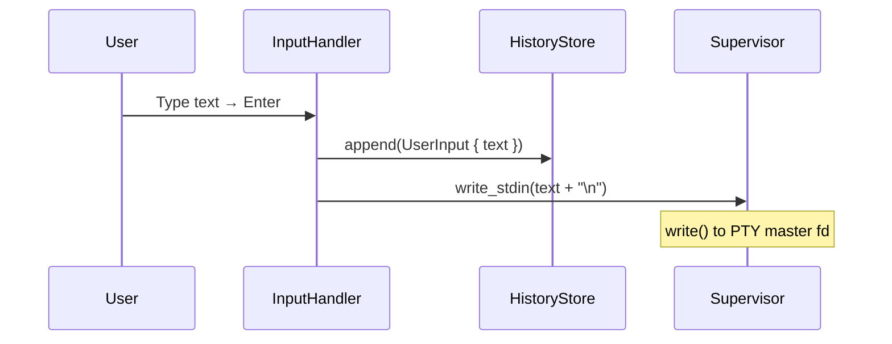

### 4.4 TUI Render Loop

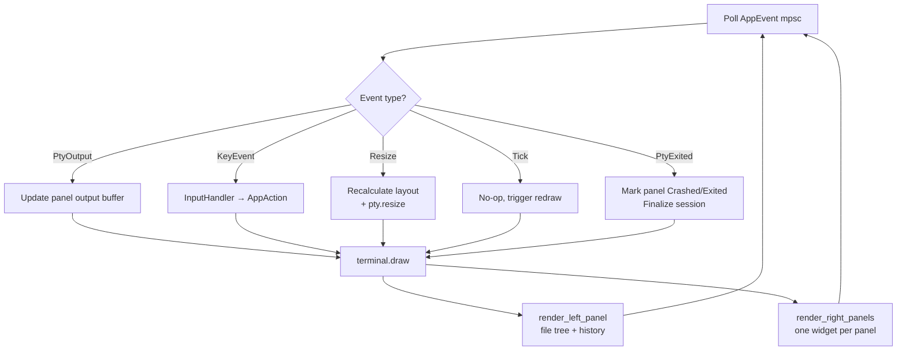

---

## 5. PTY Supervision

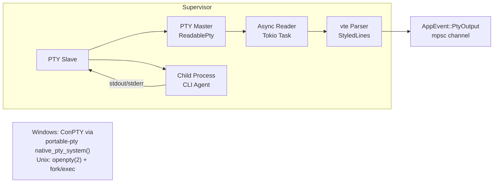

**Resize handling:**
1. `Event::Resize(cols, rows)` from crossterm
2. App recalculates panel dimensions
3. `Supervisor::resize(PtySize { rows, cols })` called per panel
4. SIGWINCH delivered to child automatically (Unix) / ConPTY notified (Windows)

---

## 6. Security Model

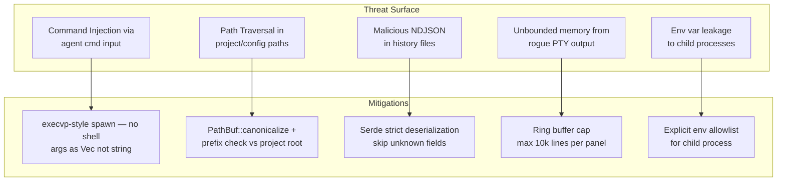

---

## 7. State Management

All mutable state lives in a single `AppState` struct. Background reader tasks communicate via `mpsc` channels — **no shared `Arc<Mutex<>>`**, eliminating lock contention.

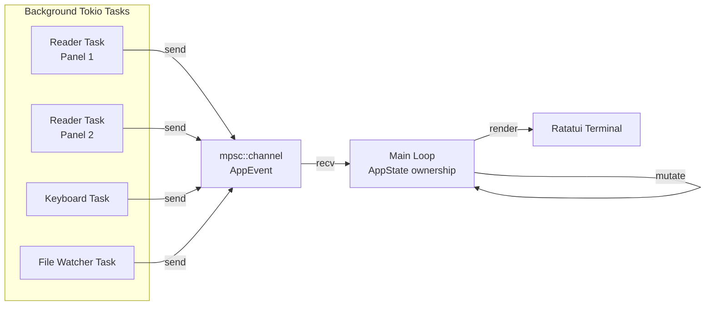

---

## 8. History Storage

Session files live at `<project-root>/.vibingide/sessions/<ULID>.ndjson`.

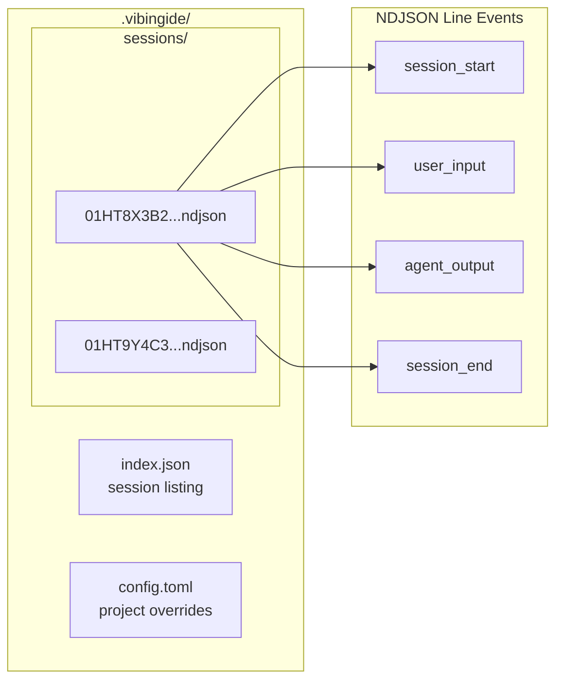

---

## 9. Build & Release

```toml
[profile.release]
opt-level     = 3
lto           = "fat"
codegen-units = 1
strip         = true
panic         = "abort"
```

**Cross-compilation targets:**

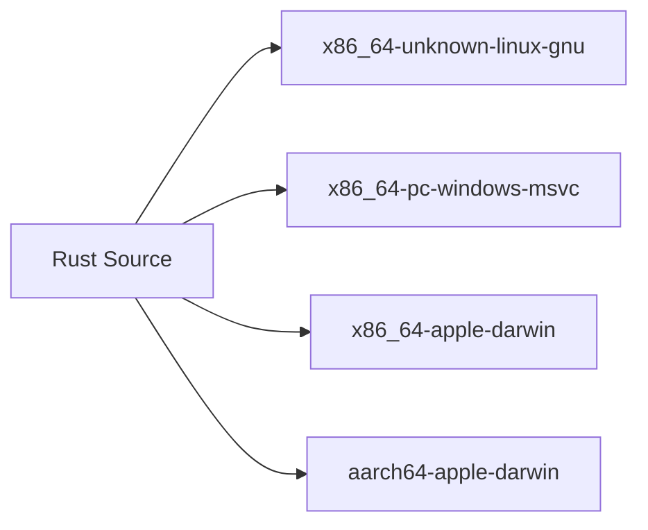

CI: GitHub Actions matrix build + `cargo-nextest`.
