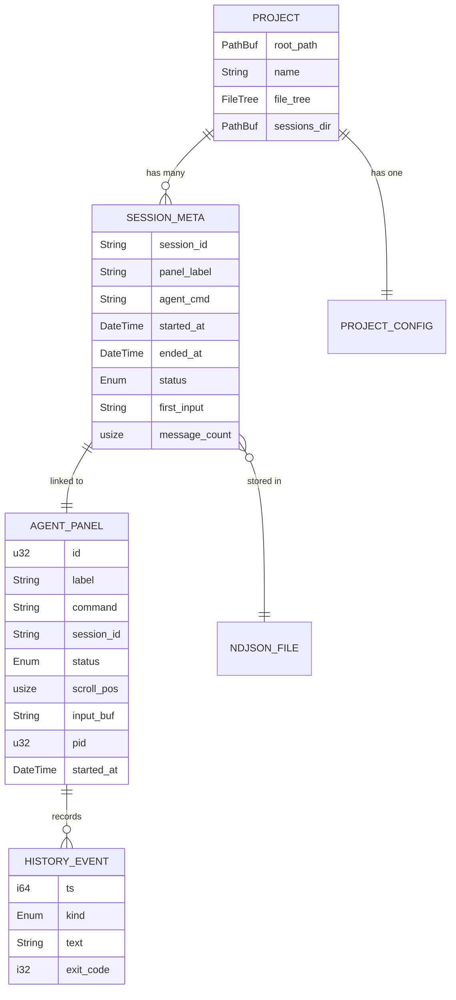
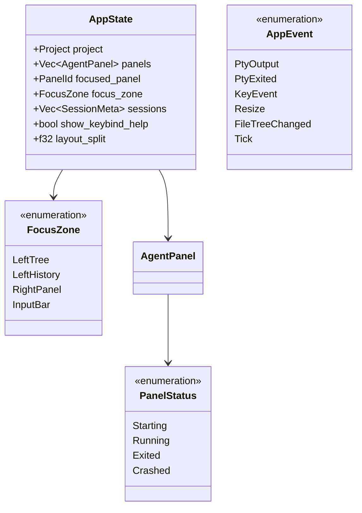
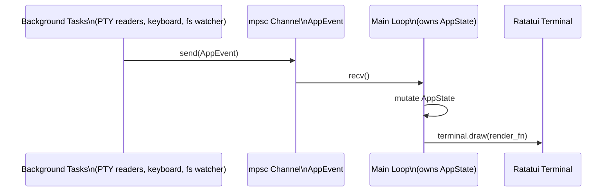
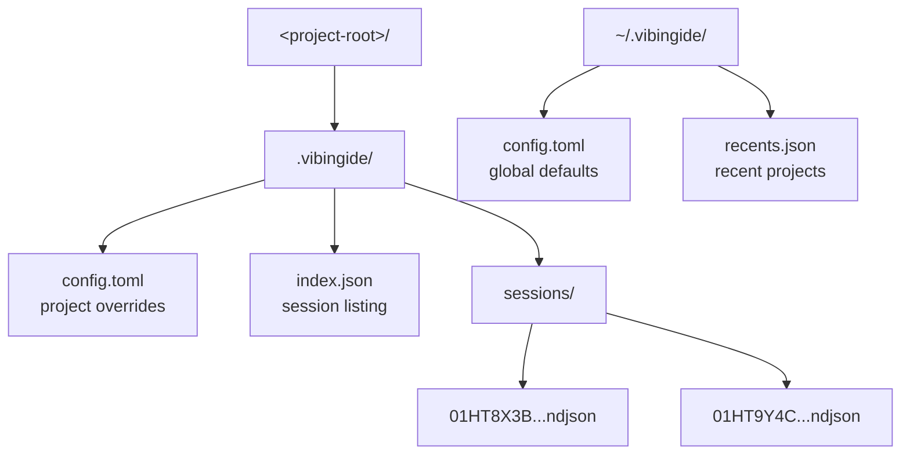
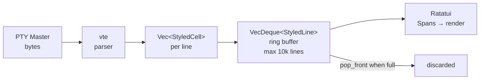
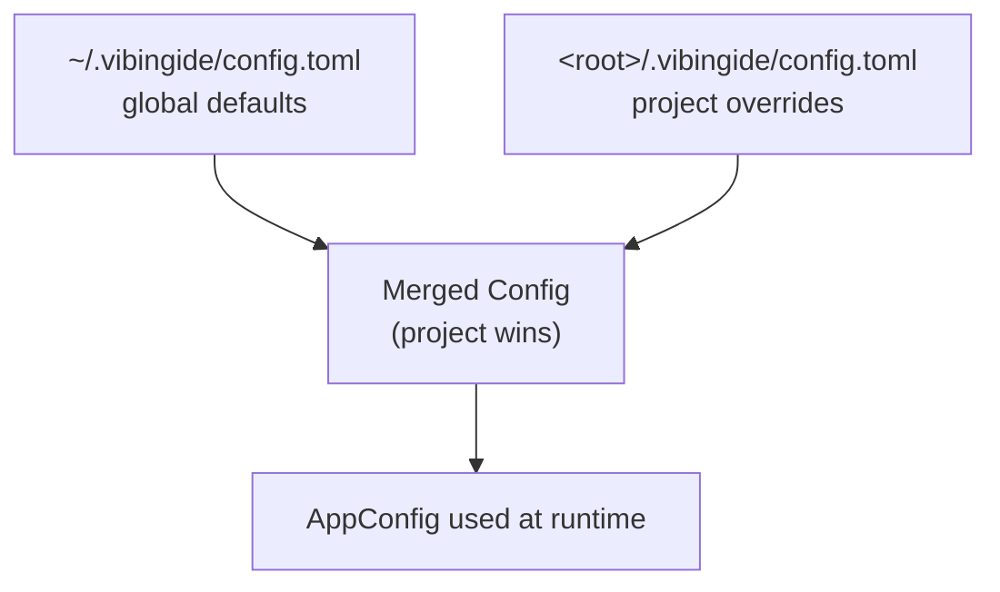

# VibingIDE — Data Model

## 1. Entity Relationships



---

## 2. Core Rust Structs

### 2.1 `Project`

```rust
struct Project {
    root_path:    PathBuf,     // Absolute path — canonicalized on open
    name:         String,      // Display name (directory basename)
    file_tree:    FileTree,    // Cached listing, refreshed on change
    sessions_dir: PathBuf,     // <root>/.vibingide/sessions/
    config:       ProjectConfig,
}
```

### 2.2 `AgentPanel`

```rust
struct AgentPanel {
    id:          PanelId,             // u32 counter
    label:       String,              // "Claude Code #1"
    command:     String,              // "claude"
    args:        Vec<String>,         // CLI args — execvp style, no shell
    status:      PanelStatus,
    session_id:  SessionId,           // ULID → links to NDJSON file
    scroll_pos:  usize,
    output_buf:  VecDeque<StyledLine>,// Ring buffer, max 10k lines
    input_buf:   String,
    pid:         Option<u32>,
    started_at:  DateTime<Utc>,
    ended_at:    Option<DateTime<Utc>>,
}

enum PanelStatus {
    Starting,
    Running,
    Exited { code: i32 },
    Crashed { signal: Option<i32> },
}
```

### 2.3 `HistoryEvent` (NDJSON line)

```rust
#[derive(Serialize, Deserialize)]
#[serde(tag = "kind", rename_all = "snake_case", deny_unknown_fields)]
enum HistoryEvent {
    SessionStart { ts: i64, agent_cmd: String, label: String, cwd: String },
    UserInput    { ts: i64, text: String },
    AgentOutput  { ts: i64, text: String },
    SessionEnd   { ts: i64, exit_code: Option<i32>, signal: Option<i32> },
}
```

---

## 3. AppState & Event Model



### Event flow (no shared mutex)



---

## 4. File Layout on Disk



### `index.json` format

```json
{
  "version": 1,
  "sessions": [
    {
      "session_id": "01HT8X3B2HYZK6E8VBXPQ5NRCS",
      "label": "Claude Code #1",
      "agent_cmd": "claude",
      "started_at": "2024-03-24T10:00:00Z",
      "ended_at":   "2024-03-24T10:45:00Z",
      "status": "closed",
      "first_input": "refactor the auth module",
      "message_count": 42
    }
  ]
}
```

---

## 5. Output Buffer Model



```rust
struct StyledLine  { cells: Vec<StyledCell> }
struct StyledCell  { ch: char, fg: Color, bg: Color, modifiers: Modifiers }
```

---

## 6. Configuration Schema



```toml
[ui]
theme                   = "dark"
left_panel_width_pct    = 25
output_buffer_lines     = 10000
scroll_speed            = 3
show_panel_borders      = true

[keybinds]
new_panel    = "ctrl+shift+n"
next_panel   = "ctrl+]"
prev_panel   = "ctrl+["
focus_input  = "ctrl+i"
focus_tree   = "ctrl+e"
focus_history = "ctrl+h"
maximize_panel = "ctrl+m"
close_panel  = "ctrl+w"

[history]
max_sessions_per_project = 500
auto_archive_after_days  = 30
store_raw_ansi           = false

[security]
child_env_allowlist = ["PATH", "HOME", "TERM", "LANG"]  # explicit passthrough
```
