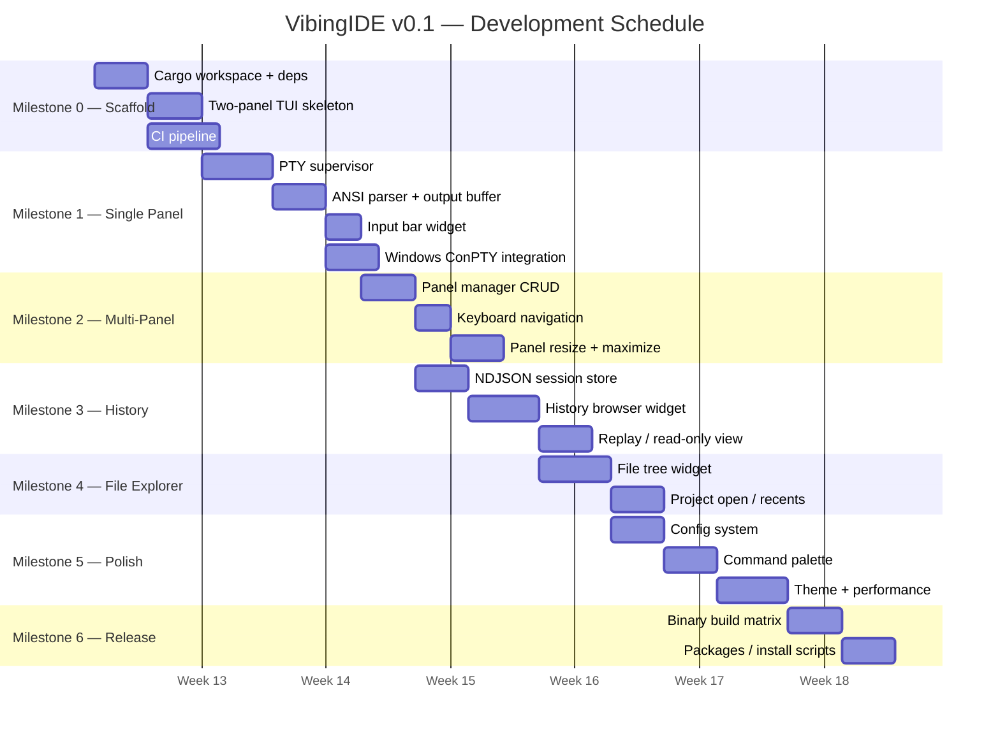
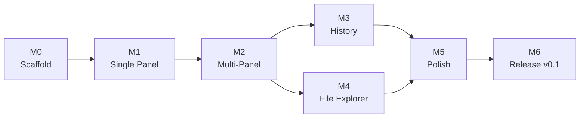
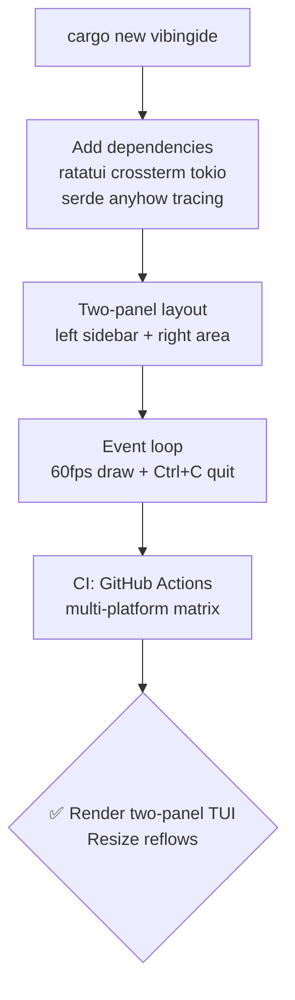
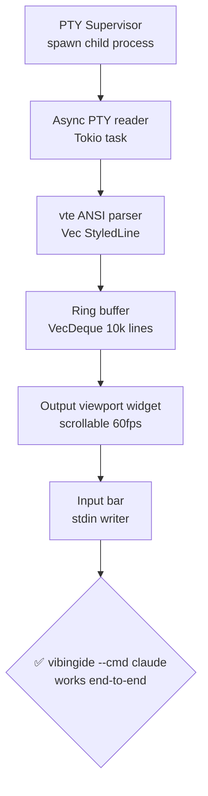
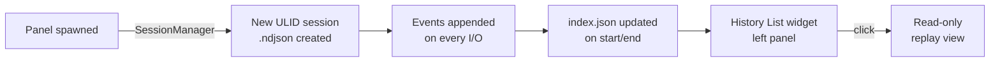
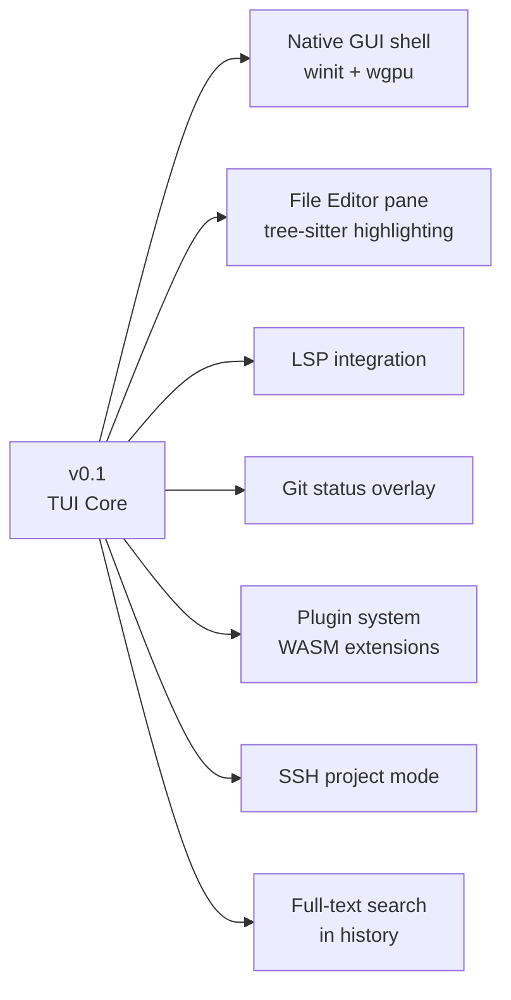

# VibingIDE — Development Roadmap

## Timeline Overview

---

## Milestone Dependency Graph

---

## 🟢 Milestone 0 — Scaffolding

**Goal**: Working Rust project that compiles; minimal TUI skeleton visible.

### Tasks
- [ ] Initialize Cargo workspace
- [ ] Add dependencies
- [ ] Basic two-panel TUI layout
- [ ] Main event loop: 60fps render, `Ctrl+C` to quit
- [ ] CI pipeline: Linux / Windows / macOS
- [ ] Logging to `~/.vibingide/debug.log` via `tracing`

---

## 🟡 Milestone 1 — Single Agent Panel

**Goal**: Spawn one CLI tool, see its ANSI output, send it input.

### Tasks
- [ ] PTY supervisor: spawn arbitrary command securely (no shell=true)
- [ ] ANSI parser pipeline → styled ring buffer
- [ ] Output viewport widget (scrollable, ANSI-colored)
- [ ] Input bar → stdin
- [ ] Panel resize → `pty.resize()`
- [ ] Windows ConPTY tested

---

## 🟠 Milestone 2 — Multi-Panel Support

**Goal**: Multiple independent agent panels, keyboard navigation.

### Tasks
- [ ] Panel manager: create, focus, close panels
- [ ] Vertical stacking layout with draggable dividers
- [ ] Keybindings: new, navigate, close, maximize
- [ ] Visual focus indicator (border color)
- [ ] Panel rename

---

## 🔵 Milestone 3 — Conversation History

**Goal**: Every session recorded and browsable.

### Tasks
- [ ] NDJSON session store with strict serde deserialization
- [ ] `index.json` maintenance
- [ ] History List widget in left panel
- [ ] Read-only replay viewer
- [ ] Auto-cleanup: archive sessions older than N days

---

## 🟣 Milestone 4 — File Explorer + Project Management

**Goal**: Left panel file tree, project open/switch.

### Tasks
- [ ] File tree widget (recursive, respects `.gitignore`)
- [ ] Keyboard navigation
- [ ] Copy path to clipboard
- [ ] `--project <path>` CLI flag + startup picker
- [ ] Recent projects list
- [ ] Project switch

---

## ⚪ Milestone 5 — Polish + Config

**Goal**: Production-ready UX and configuration system.

### Tasks
- [ ] Global + project config parsing
- [ ] Keybinding customization
- [ ] Command palette (`Ctrl+P`)
- [ ] Keybinding help overlay (`?`)
- [ ] Theme: dark / light / custom
- [ ] Toast notifications
- [ ] Performance: < 60 MB RAM, < 250 ms startup

---

## 🚀 Milestone 6 — Release v0.1

### Tasks
- [ ] GitHub Actions release matrix → binary artifacts
- [ ] LTO + strip + `panic = abort` optimization
- [ ] Install scripts (Linux/macOS curl-pipe, Windows winget)
- [ ] README with demo GIF
- [ ] CHANGELOG

---

## 🔮 Post v0.1 Backlog

