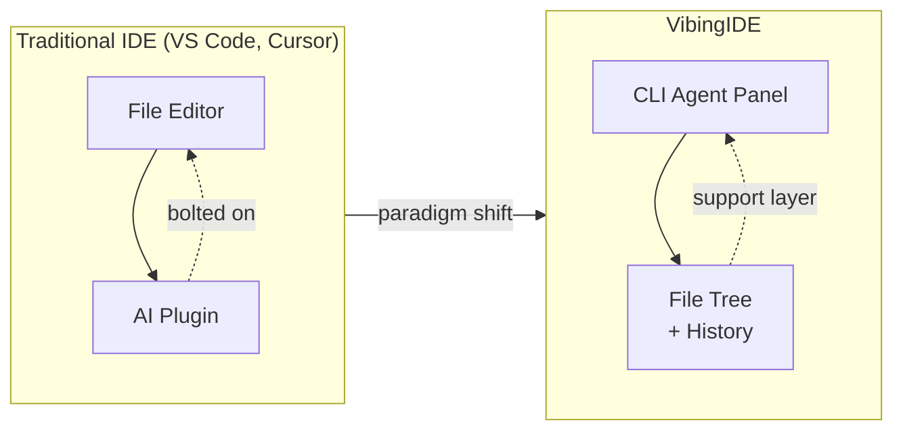
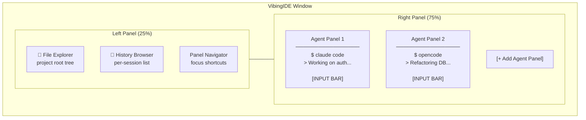
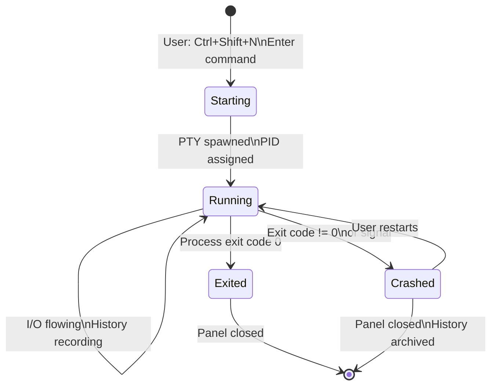
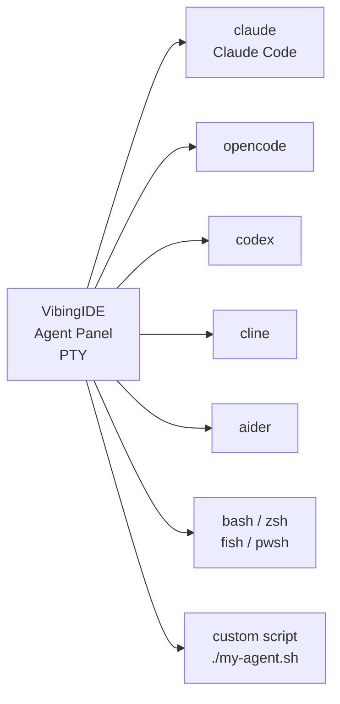
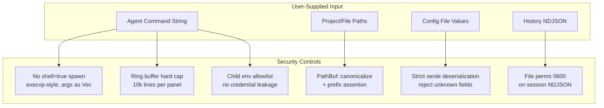

# VibingIDE — Product Specification

> **Agent-First IDE. Blazing Fast. Built in Rust.**

---

## 1. Vision

VibingIDE is a **keyboard-driven, ultra-lightweight, terminal-native IDE** designed around AI coding agents. Where traditional IDEs treat AI as a plugin, VibingIDE makes the CLI agent the primary interface — the editor and project explorer are the *support layer*.

### Core Tenets

| Tenet | Description |
|---|---|
| **Agent-First** | Every workspace orbits an active CLI agent session |
| **Zero Bloat** | < 20 MB binary; no Electron, no JVM, no runtime |
| **Blazing Performance** | Sub-10ms startup; < 50 MB RAM at idle |
| **Multi-Agent** | Multiple CLI agent panels per project, each independent |
| **Per-Agent History** | Each agent panel has its own persistent conversation log |

---

## 2. Problem Statement

Existing editors bolt AI on top of a file-editing paradigm. VibingIDE inverts this: the agent shell is the center of gravity.

---

## 3. Layout Overview

---

## 4. Agent Panel Lifecycle

---

## 5. Panel Definitions

### 5.1 Left Panel

The left panel is a **persistent sidebar** tied to the open project directory.

#### A. File Explorer
- Tree view of the project root directory
- Respects `.gitignore` rules
- Click to copy path; right-click for context menu

#### B. Conversation History Browser
- Lists all saved conversations for the current project
- Stored in `<project-root>/.vibingide/sessions/`
- Each entry shows: agent name, date/time, first message snippet, status badge
- **Each right-panel agent session has its own history entry — never merged**

#### C. Panel Navigator
- Lists all open agent panels
- Click to jump focus; indicator for panels with unseen output

### 5.2 Right Panel(s) — Agent Panels

| Element | Description |
|---|---|
| **Header bar** | Agent command, PID, uptime, status badge |
| **Output viewport** | Scrollable, ANSI-aware terminal output |
| **Input bar** | Fixed at bottom; sends stdin to agent process |
| **Conversation log** | Auto-captured and persisted to NDJSON |

---

## 6. CLI Tool Compatibility

VibingIDE is **tool-agnostic** — it runs any command in a PTY.

---

## 7. Keybindings

| Action | Default |
|---|---|
| New agent panel | `Ctrl+Shift+N` |
| Switch to next panel | `Ctrl+]` |
| Switch to prev panel | `Ctrl+[` |
| Focus input bar | `Ctrl+I` |
| Focus file tree | `Ctrl+E` |
| Focus history | `Ctrl+H` |
| Maximize current panel | `Ctrl+M` |
| Close current panel | `Ctrl+W` |
| Open project | `Ctrl+O` |
| Command palette | `Ctrl+P` |
| Keybind help | `?` |

---

## 8. Performance Requirements

| Metric | Target |
|---|---|
| Cold startup time | < 250 ms |
| Binary size | < 25 MB (uncompressed) |
| RAM at idle (1 panel) | < 60 MB |
| RAM per additional panel | < 5 MB each |
| Input latency (keystroke → PTY) | < 5 ms |
| Scroll FPS | ≥ 60 FPS |

---

## 9. Security Requirements

---

## 10. Out of Scope (v0.1)

- Built-in code editor / syntax highlighting
- Git GUI integration
- LSP / autocomplete
- Plugin/extension system
- Cloud sync of history
